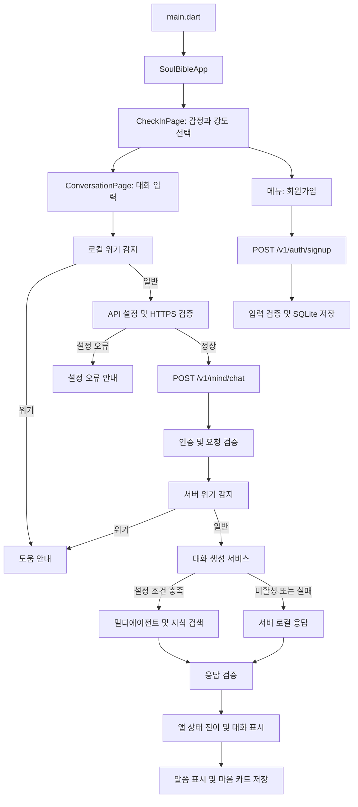

# ONARIA 앱 프로세스별 코드 안내

작성일: 2026-09-09. 프로젝트: `C:\Users\SJ\AndroidStudioProjects\soul-bible`, 브랜치: `main`.

현재 파일 배치와 실행 흐름을 기준으로 정리했다. 이번 작업은 문서화이며 코드 이동·파일명 변경·기능 수정은 하지 않았다. 환경변수 이름은 코드상 설정 인터페이스를 설명하기 위한 것이며 실제 .env·인증 값·운영 서버 설정은 확인하지 않았다.

## 1. 전체 실행 흐름



서버 로컬 응답은 서버 내부의 대체 응답이다. 앱의 이전 HTTP 주소 fallback과는 관계가 없다. 잘못된 앱 API 설정을 데모 응답으로 숨기는 경로는 제거되어 있다.

## 2. 앱 시작과 감정 선택

| 파일 | 진입점·함수 | 역할 |
| --- | --- | --- |
| [lib/main.dart](lib/main.dart) | `main()` | Flutter 초기화 후 앱 실행 |
| [lib/app/soul_bible_app.dart](lib/app/soul_bible_app.dart) | `SoulBibleApp`, `initState()`, `build()` | 테마 로드, MaterialApp 구성, 첫 화면 지정 |
| [lib/app/theme_controller.dart](lib/app/theme_controller.dart) | `ThemeController` | 테마 상태 관리 |
| [lib/app/app_theme.dart](lib/app/app_theme.dart) | `AppTheme` | 공통 색상과 스타일 |
| [lib/app/space_scaffold.dart](lib/app/space_scaffold.dart) | `SpaceScaffold` | 공통 화면 배경·레이아웃 |
| [lib/features/check_in_page.dart](lib/features/check_in_page.dart) | `_selectEmotion()`, `_loadDailyUsage()`, `_startConversation()` | 감정·강도 입력, 사용 횟수 조회, 대화 화면 이동 |
| [lib/app/mind_card_store.dart](lib/app/mind_card_store.dart) | `DailyUsageStore` | 사용 횟수 저장 |

첫 화면은 회원가입 화면이 아니라 `CheckInPage`다. 회원가입과 저장된 카드는 메뉴에서 접근한다. 임의로 로그인 필수 흐름으로 변경하지 않는다.

## 3. 채팅 요청과 통신 규칙

| 파일 | 함수·형식 | 역할 |
| --- | --- | --- |
| [lib/features/conversation_page.dart](lib/features/conversation_page.dart) | `_send()` | 입력 → 위기 감지 → 허용 말씀 조회 → 요청 → 응답 표시 |
| [lib/app/api_config.dart](lib/app/api_config.dart) | `baseUrl`, `chatUrl`, `isAllowedEndpoint()`, `requireSecureEndpoint()` | 기본 주소·override·HTTPS 정책 |
| [lib/src/api/llm_api_client.dart](lib/src/api/llm_api_client.dart) | `ProxyLlmApiClient.send()` | JSON POST, 인증 헤더 구성, redirect 차단, 오류 처리 |
| [lib/src/api/llm_models.dart](lib/src/api/llm_models.dart) | `LlmConversationRequest`, `LlmConversationResponse` | JSON 직렬화와 응답 파싱 |
| [lib/src/conversation/conversation_models.dart](lib/src/conversation/conversation_models.dart) | `ConversationSession` | 세션·감정·대화 단계·요약 상태 |
| [lib/src/conversation/conversation_machine.dart](lib/src/conversation/conversation_machine.dart) | `applyLocalCrisis()`, `applyLlmResponse()` | 상태 전이 및 UI 행동 결정 |

통신 규칙:

- 기본 주소: `https://api.onaria.ai.kr`.
- 채팅 경로: `/v1/mind/chat`. 루트 기준으로 resolve하므로 base URL의 하위 경로를 덧붙이는 방식이 아니다.
- `SOUL_BIBLE_API_BASE_URL`은 `String.fromEnvironment`로 읽는 빌드 시점 설정이다. 변경하려면 `--dart-define`을 적용해 앱을 다시 실행·빌드해야 한다.
- 운영에서는 HTTPS만 허용한다. debug에서는 localhost, 127.0.0.1, ::1, 10.0.2.2의 HTTP를 허용한다.
- 채팅 요청 제한 시간은 기본 25초이며 자동 redirect를 따르지 않는다.
- 설정 오류는 설정 안내, 통신 실패는 연결 실패 안내로 표시한다.
- 비동기 작업 이후 `mounted`를 검사한다. 페이지 종료 이후 응답이나 오류가 도착해도 `setState()`를 호출하지 않는다.
- [lib/app/demo_llm_client.dart](lib/app/demo_llm_client.dart)는 남아 있는 데모 구현이며 현재 기본 채팅 경로에서 자동 선택되지 않는다.

## 4. Safety, 멀티에이전트, RAG

| 단계 | 관련 파일 | 역할 |
| --- | --- | --- |
| 앱 위기 감지 | [crisis_detector.dart](lib/src/safety/crisis_detector.dart), [crisis_models.dart](lib/src/safety/crisis_models.dart) | 서버 요청 전 위기 평가 |
| HTTP 경계 | [app.js](backend/src/app.js), [schema.js](backend/src/schema.js) | 인증, 입력 검증, rate limit, 응답 검증 |
| 서버 위기 감지 | [crisis.js](backend/src/crisis.js), [safety_agent.js](backend/src/agents/safety_agent.js) | 일반 생성·검색보다 먼저 안전 경로 판단 |
| 에이전트 선택 | [ai_router.js](backend/src/ai_router.js), [religion_router.js](backend/src/agents/religion_router.js) | 요청 모드·언어·맥락에 맞는 라우팅 |
| 서비스 구성 | [conversation_service.js](backend/src/conversation_service.js) | 외부 생성 활성화 조건, 제한 시간, 실패 시 대체 응답 |
| 오케스트레이션 | [conversation_orchestrator.js](backend/src/agents/conversation_orchestrator.js) | 전문 에이전트와 지식 검색의 흐름 조정 |
| 전문 응답 | [psychology_agent.js](backend/src/agents/psychology_agent.js), [religions](backend/src/agents/religions) | 심리 성찰·전통별 전문 처리 |
| 응답 통합 | [response_integrator.js](backend/src/agents/response_integrator.js), [specialist_result.js](backend/src/agents/specialist_result.js) | 전문 결과를 응답 계약으로 통합 |
| 지식 공급 | [provider.js](backend/src/knowledge/provider.js), [production_index.js](backend/src/knowledge/production_index.js) | 개발 자료 또는 운영 인덱스 공급 |
| 검색 | [retrieval_strategy.js](backend/src/knowledge/retrieval_strategy.js), [retriever.js](backend/src/knowledge/retriever.js), [hybrid_retriever.js](backend/src/knowledge/hybrid_retriever.js) | 설정에 따른 키워드·벡터·혼합 검색 |
| 검색 품질 | [reranker.js](backend/src/knowledge/reranker.js), [retrieval_confidence.js](backend/src/knowledge/retrieval_confidence.js), [source_quality.js](backend/src/knowledge/source_quality.js) | 재정렬·신뢰도·출처 평가 |
| 인용·무결성 | [citation_validator.js](backend/src/agents/citation_validator.js), [citation_grounding.js](backend/src/agents/citation_grounding.js), [religious_integrity_agent.js](backend/src/agents/religious_integrity_agent.js) | 출처 근거와 응답 무결성 검증 |
| 서버 대체 응답 | [local_conversation_service.js](backend/src/local_conversation_service.js) | 외부 생성 비활성·실패 시 로컬 응답 |
| 세션 요약 | [memory_store.js](backend/src/memory_store.js) | 서버 세션별 요약 관리 |

외부 멀티에이전트는 `SOUL_AI_MODE`, `SOUL_MULTI_AGENT_ENABLED`, 외부 API 제한 및 유효한 인증 설정 등 코드상 조건을 만족해야 한다. RAG의 운영 인덱스와 검색 방식도 설정에 따른다. 코드·테스트의 존재만으로 운영 활성화 상태를 확정하지 않는다. 서버 대체 응답은 유지하며 정상 생성·위기 응답·대체 응답을 모두 구분해 검증해야 한다.

자료 준비 및 평가 코드는 [knowledge/ingestion](backend/src/knowledge/ingestion), `production_*`, `expert_*`, `*_pilot.js`, [evaluation](backend/src/evaluation)에 있다. 일반 앱 요청 경로와 자료 검수·인덱스 생성·평가 작업은 별개다. 운영 인덱스 생성·교체 명령을 일반 회귀 테스트처럼 실행하지 않는다.

## 5. 회원가입과 저장

| 파일 | 함수 | 역할 |
| --- | --- | --- |
| [signup_page.dart](lib/features/signup_page.dart) | `_submit()` | 입력 확인, 가입 요청, 성공 후 이전 화면 복귀 |
| [member_api_client.dart](lib/src/api/member_api_client.dart) | `signUp()` | `/v1/auth/signup` 호출, HTTPS 검증, redirect 차단, 기본 15초 제한 |
| [app.js](backend/src/app.js) | `POST /v1/auth/signup` | 가입 요청 처리 |
| [member_schema.js](backend/src/member_schema.js) | `memberSchema`, `publicMember()`, `adminMember()` | 입력 검증·번호 정규화·응답 및 관리자 마스킹 |
| [member_store.js](backend/src/member_store.js) | `createMemberStore()`, `create()`, `getAdminOverview()` | SQLite 저장·중복 번호 거절·관리자 조회 |

회원가입은 현재 회원 정보 등록이다. 이 흐름을 OAuth 로그인·휴대폰 소유 확인·사용자 인증 세션 발급이 완료된 것으로 해석하지 않는다. 네이버·카카오·Google 버튼은 준비 중 안내다. 실제 개인정보 대신 임시 DB와 합성 입력으로 회귀 테스트한다.

## 6. 말씀, 마음 카드, 음성 및 확장 기능

| 기능 | 코드 위치 | 현재 연결 상태 |
| --- | --- | --- |
| 말씀 조회 | [verse_repository.dart](lib/src/verses/verse_repository.dart), [asset_loader.dart](lib/app/asset_loader.dart), `assets/data/bible_verses_ko.json` | 채팅의 허용 말씀 조회와 표시에서 사용 |
| 말씀 표시 | `ConversationPage._acceptVerse()`, `_showVerseAutomatically()` | 대화 상태와 응답에 따라 표시 |
| 마음 카드 저장 | `ConversationPage._saveMindCard()`, `MindCardStore.save()` | 기기에 저장 |
| 저장 카드 조회·삭제 | [saved_cards_page.dart](lib/features/saved_cards_page.dart), `MindCardStore.getAll()`, `delete()` | 메뉴에서 접근 |
| 음성 입력 | `ConversationPage._toggleVoiceInput()` | 채팅 화면에 연결, 실기기 검증 별도 |
| 말씀 읽기 | `ConversationPage._toggleVerseSpeech()` | 채팅 화면에 연결, 실기기 검증 별도 |
| 알림 | [reminder_controller.dart](lib/engagement/notifications/reminder_controller.dart), [native_notifications.dart](lib/engagement/notifications/native_notifications.dart), [notification_settings_page.dart](lib/engagement/notifications/notification_settings_page.dart) | 구현 존재; 현재 앱 진입점에서 설정 화면으로의 연결 호출은 확인되지 않음 |
| 공유 | [sharing](lib/engagement/sharing) | 구현 존재; 현재 주요 화면에서 공유 미리보기로의 연결 호출은 확인되지 않음 |
| 미니게임 | [cross_light](lib/engagement/mini_games/cross_light) | 구현 존재; 현재 주요 화면에서 게임으로의 연결 호출은 확인되지 않음 |
| 여정·성취·이벤트 | [engagement_controller.dart](lib/engagement/engagement_controller.dart), [journey](lib/engagement/journey), [achievements](lib/engagement/achievements), [domain_events.dart](lib/engagement/domain_events.dart) | 확장 구현; 앱 루트의 EngagementScope 연결은 확인되지 않음 |

구현 파일이 존재한다는 사실과 사용자가 메뉴로 접근할 수 있다는 사실을 구분한다. 위 확장 기능을 노출하는 작업은 화면 연결과 실기기 검증을 포함한 별도 기능 작업이다.

## 7. 플랫폼 및 배포 코드

| 위치 | 책임 |
| --- | --- |
| [android/app/src/main/AndroidManifest.xml](android/app/src/main/AndroidManifest.xml) | 앱 권한, 액티비티, 알림 receiver, 보안 XML 참조 |
| [main network_security_config.xml](android/app/src/main/res/xml/network_security_config.xml) | 운영 cleartext 차단 |
| [debug network_security_config.xml](android/app/src/debug/res/xml/network_security_config.xml) | 개발 loopback HTTP 예외 |
| [android/app/build.gradle.kts](android/app/build.gradle.kts) | SDK·Java·desugaring·기존 서명 연결 |
| [android/build.gradle.kts](android/build.gradle.kts) | 공통 빌드 출력 경로 |
| [ios/Runner/Info.plist](ios/Runner/Info.plist) | 표시 이름·음성 권한·Scene 설정 |
| [ios/Runner/AppDelegate.swift](ios/Runner/AppDelegate.swift), [SceneDelegate.swift](ios/Runner/SceneDelegate.swift) | iOS 진입점·플러그인 등록 |
| [ios/Runner.xcodeproj](ios/Runner.xcodeproj), [ios/Runner.xcworkspace](ios/Runner.xcworkspace), [ios/Podfile](ios/Podfile) | 복구한 Xcode 프로젝트·의존성 연결 |

## 8. 검증 순서와 관련 테스트

프로젝트 루트에서:

```powershell
flutter pub get
flutter analyze
flutter test
flutter test test/conversation_lifecycle_test.dart --dart-define=SOUL_BIBLE_API_BASE_URL=http://lightshare8.mycafe24.com
npm.cmd --prefix backend test
flutter build apk --release
flutter build appbundle --release
```

위 HTTP 주소는 잘못된 override의 거절 여부를 검증하는 테스트 입력이다. 운영 빌드에는 전달하지 않는다. `flutter analyze`는 info만 있어도 종료 코드 1일 수 있으므로 error/warning/info를 구분한다. 빌드는 테스트 통과 후 수행하고 서명 비밀 값을 출력하지 않는다.

| 검증 대상 | 테스트 위치 |
| --- | --- |
| 초기 화면·회원가입 메뉴·뒤로 가기 | [widget_test.dart](test/widget_test.dart) |
| 화면 종료 후 성공·실패 응답, 설정 오류 | [conversation_lifecycle_test.dart](test/conversation_lifecycle_test.dart) |
| HTTPS·개발 예외·redirect 차단 | [api_transport_security_test.dart](test/api_transport_security_test.dart) |
| 앱 상태 전이·위기 감지 | [conversation_machine_test.dart](test/conversation_machine_test.dart), [crisis_detector_test.dart](test/crisis_detector_test.dart) |
| 응답 JSON 계약 | [backend_contract_test.dart](test/backend_contract_test.dart) |
| UI·음성 보조 로직 | [conversation_examples_test.dart](test/conversation_examples_test.dart), [verse_speech_test.dart](test/verse_speech_test.dart) |
| 테마·사용 횟수 | [theme_selection_test.dart](test/theme_selection_test.dart), [daily_usage_store_test.dart](test/daily_usage_store_test.dart) |
| HTTP·대화 통합 | [app.test.js](backend/test/app.test.js), [chat_integration.test.js](backend/test/chat_integration.test.js) |
| SQLite 저장·재열기·중복·마스킹 | [member_store.test.js](backend/test/member_store.test.js) |
| 개인정보·오류 로그 | [privacy_security.test.js](backend/test/privacy_security.test.js) |
| 에이전트·대체 응답 | `backend/test/*orchestrator.test.js`, `*service.test.js`, `*agents.test.js` |
| RAG·자료·운영 정책 | `backend/test/*rag.test.js`, `*corpus.test.js`, `*pilot.test.js`, `production_deployment.test.js` |

## 9. 가장 최근 검증 상태와 다음 작업

아래는 이전 작업에서 수행한 결과이며 이번 문서화에서 테스트나 빌드를 재실행하지 않았다.

| 항목 | 확인 결과 |
| --- | --- |
| Flutter 분석 | error 0 / warning 0 / info 7 |
| Flutter 기본 테스트 | 31개 통과, override 전용 1개 skip |
| HTTP override 전용 실행 | 3개 통과; 위 skip한 테스트 포함 |
| Backend | 272개 통과; 실제 임시 SQLite 사용 |
| Release APK·AAB | 빌드 성공, APK 서명 검증 성공 |
| 휴대폰 | SM-S908N에 USB 업데이트 설치·실행 성공, 데이터 삭제 없음 |
| 운영 `/health`, `/v1/mind/chat`, `/v1/auth/signup` | PC에서 HTTPS 연결 시간 초과 |
| 휴대폰 운영 `/health` | 443 연결 실패 |
| iOS | 프로젝트 구성 복구; macOS 빌드·서명·실기기 미검증 |

다음 작업은 외부 443 연결 복구 → health 응답 → 채팅 인증·정상 응답·위기 경로 → 승인된 테스트 회원가입 → 음성·저장·알림 등 실제 접근 가능한 기능 → 내부 배포 검증 순이다. 현재 네트워크 오류만으로 서버 애플리케이션이나 인증이 정상이라고 판단하지 않는다. 서버 연결 복구는 별도 서버 점검 범위이며 이 문서는 서버 설정 변경을 포함하지 않는다.

수정 및 산출물 이력: [APP_RUNTIME_REPAIR_REPORT.md](APP_RUNTIME_REPAIR_REPORT.md). 과거 빌드 기록: [BUILD_REPAIR_REPORT.md](BUILD_REPAIR_REPORT.md). 보안 검토 기록: [SECURITY_PRIVACY_REVIEW.md](SECURITY_PRIVACY_REVIEW.md).
